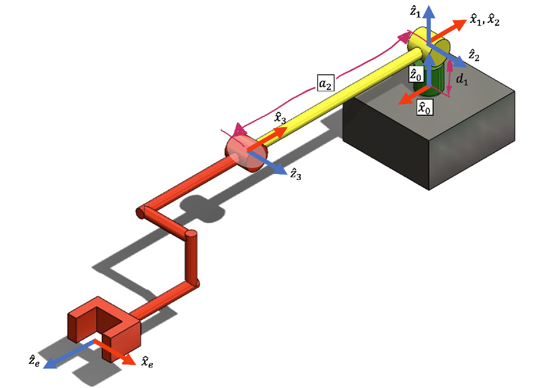

# FRA333 HW3 6549_6565

## ข้อที่ 1 จงเขียนฟังก์ชั่นในการ Jacobian ของหุ่นยนต์ตัวนี้ให้อยู่ในฟังก์ชั่นต่อไปนี้
- ฟังก์ชัน endEffectorJacobianHW3 ที่รับค่า input เป็น list ของค่า Configuration space มีจำนวนเท่ากับจำนวน Joint ของหุ่นยนต์ (q = [q1,q2,q3]) และ Return ออกมาเป็น Jacobian Matrix (Numpy Array)
- เริ่มจากการนำค่าที่ Return มาจากฟังก์ชัน FKHW3(q) ที่โจทย์ได้กำหนดมาให้มาแยกเก็บไว้ในตัวแปรซึ่งประกอบไปด้วย Rotation Matrix และ Position Vector ของแต่ละเฟรม, Rotation Matrix และ Position Vector ของเฉพาะ End-effector แล้วจึงนำแต่ละค่าไปคำนวณหา Jacobian Matrix ตามคำอธิบายที่ได้ Comment ไว้ใน Code
```python
 def endEffectorJacobianHW3(q:list[float]):
    
    # Forward Kinematic function, consist of Rotation matrix from frame 0 to frame 1-3 / Position vector from frame 0 to frame 1-3 
    # / Rotation matrix from frame 0 to end-effector / Position vector from frame 0 to end-effector frame
    R,P,R_e,P_e = FKHW3(q)

    #  Rotation matrix from end_effector to frame 0
    R_e_0 = np.array(R_e).transpose()

    # Store the Jacobian components
    J_temp = []

    # Extract the data from function
    for i in range(len(q)):

        # Position vector 
        P_0_i = P[:,i]

        # Rotation matrix
        Z_i = np.array(R[:,2,i])

        # Linear Jacobian 
        J_i = np.array(np.cross(Z_i,(P_e - P_0_i)))

        # Combine the Angular Jacobian with Linear Jacobian in vertical to be a Jacobian component matrix
        J_col = np.vstack((R_e_0 @ J_i.reshape(3,1),R_e_0 @ Z_i.reshape(3,1))) ## Reference at the end effector

        # Append the component to J_temp
        J_temp.append(J_col)

    # Combine the matrix in horizontal to be a Jacobian matrix
    J = np.hstack(J_temp)
    return J
```
### ผลลัพธ์


ตรวจคำตอบ: คำตอบที่ได้จากการใช้ Roboticstoolbox กับ Function ที่สร้างขึ้นมามีค่าเท่ากัน

## ข้อที่ 2 จงเขียนฟังก์ชั่นในการหาสภาวะ Singularity
- ฟังก์ชัน checkSingularityHW3 ที่รับค่า input เป็น list ของค่า Configuration space มีจำนวนเท่ากับจำนวน Joint ของหุ่นยนต์ (q = [q1,q2,q3]) ซึ่งภายในฟังก์ชัน ได้มีการใช้ฟังก์ชัน endEffectorJacobianHW3 ของข้อที่ 1 เพื่อหา Determinant และ Return ออกมาเป็น Boolean แสดงสถานะของสภาวะ Singularity ของหุ่นยน โดย True หมายถึงอยู่ในสภาวะ Singularity และ False หมายถึง ไม่ได้อยู่ในสภาวะดังกล่าว
- ทำการหา Determinant ของ Jacobian Matrix และตั้ง Threshold สำหรับค่าที่เข้าใกล้ 0 ที่ทศนิยม 4 หลัก หากมีค่าเข้าใกล้ 0 ตาม Threshold ที่ตั้งไว้จะถือว่าอยู่ในสภาวะ Singularity ซึ่งมีการเขียนคำอธิบายไว้ใน Comment ด้านล่างนี้
```python
def checkSingularityHW3(q:list[float])->bool:

    # We can't control the orientation at the end effector, compute only linear and remove the angular term. 
    J = endEffectorJacobianHW3_Simplified(q)[:3,:]

    # Determinant of Jacobian Matrix
    det_J = np.linalg.det(J)
    flag = None
    # Threshold for checking if det is not equal to 
    if abs(det_J) < 1e-4:  
        flag = True
    else:
        flag = False
    
    print(f"\n Determinant of Jacobian Matrix: {det_J} \n Singularity Status: {flag} \n")

    return flag
```
### ผลลัพธ์


ตรวจคำตอบ: ค่า Determinant ของ Jacobian Matrix ต้องเท่ากับ 0 เมื่อมี Singularity

## ข้อที่ 3 จงเขียนฟังก์ชั่นในการหาeffortของแต่ละข้อต่อเมื่อมี wrench มากระทำกับจุดกึ่งกลางของเฟรมพิกัด F_e
- ฟังก์ชัน computeEffortHW3 จะรับค่า input เป็น list ของค่า Configuration space มีจำนวนเท่ากับจำนวน Joint ของหุ่นยนต์ (q = [q1,q2,q3]) กับค่า wrench ที่มี 6 ตัว w = [fx, fy, fz, τx, τy, τz] โดยนำค่าที่ได้จากฟังก์ชัน endEffectorJacobianHW3 ของข้อที่ 1 มา Cross จะทำให้ได้ค่าของแรงที่กระทำจากภายนอก
- เมื่อที่ได้คำตอบออกมาค่าดังกล่าวจะมีค่าตรงข้ามกับแรงของหุ่นยนต์ที่คิดได้จาก roboticstoolbox

```python
def computeEffortHW3(q:list[float], w:list[float])->list[float]:
    J_e = (endEffectorJacobianHW3(q))
    J_T = np.transpose(J_e) # Jacobian matrix transpose
    
    effort = J_T @ w # J_T cross to wrench
    return effort
```
### ผลลัพธ์


ตรวจคำตอบ: คำตอบที่ได้จากการใช้ Roboticstoolbox กับ Function ที่สร้างขึ้นมามีค่าตรงข้ามกันหรือรวมกันได้เท่ากับศูนย์